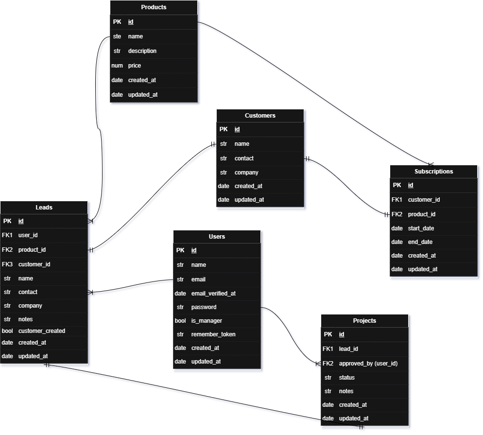

# Matthew CRM

Aplikasi CRM (Customer Relationship Management) sederhana berbasis Laravel 11 dan PostgreSQL, dibuat untuk memenuhi tugas pengembangan web dengan ketentuan waktu 3x24 jam.

---

## 🚀 Fitur Utama

- Autentikasi pengguna (Login , Logout)
- Manajemen data Layanan Produk (CRUD) (Manager Only)
- Manajemen project untuk proses lead (calon customer)
- Penambahan Lead dari pihak Sales
- Delete Subscription yang bisa dilakukan oleh Manager saja
- Role-based access (Manager & sales)
- Responsive UI dengan Tailwind CSS
- Relasi antar tabel menggunakan Eloquent ORM

---

## 🧠 Flow Aplikasi (Asumsi)

1. Sales / Manager melakukan login
   
   -- FLOW SALES --
2. Sales dapat melihat data lead pada halaman /leads untuk menambahkan data lead atau track setiap proposal lead (yang diajukan ke manager) yang masih pending , approved / rejected dari manager.
3. Setelah di proses oleh pihak manager , data lead pada website akan diperbarui dan sales akan melakukan kontak kepada setiap lead bahwa produk layanan yang ingin mereka beli itu approved/rejected karena alasan tertentu.
4. Sales HANYA dapat melihat layanan produk yang disediakan oleh PT. Smart pada halaman /products (tidak bisa Create, Update , Delete)

   -- FLOW MANAGER --
2. Setelah login , tugas utama manager adalah untuk memproses dan memverifikasi setiap data lead yang sudah diajukan oleh pihak sales untuk akhirnya di approve/reject karena alasan yang diberikan oleh manager. (di /projects)
3. Manager dapat view detail setiap lead yang diajukan dan akhirnya menulis notes yang bisa dibaca oleh pihak sales nantinya (alasan di approve / reject)
4. Jika project di approve oleh manager , data dari lead (calon customer) yang diajukan , akan berubah menjadi customer (sudah berlangganan)
5. Karena sudah menjadi customer, maka data customer akan didaftarkan dalam halaman Customer's Subscription (/subscriptions) untuk melihat customer yang sudah berlangganan disertai layanan yang mereka ambil.
6. Manager dapat CRUD untuk bagian produk layanan yang disediakan oleh PT. Smart
7. Manager juga dapat melakukan 'End Subscription' pada halaman /subscriptions untuk menghentikan layanan produk yang diambil oleh customer secara PAKSA

Beberapa Asumsi :
- Sales hanya dapat create lead , dan baca berbagai list produk saja
- Sales hanya diberi akses pada /leads dan /products
- Manager diberikan akses semuanya seperti /leads , /products, /projects , /subscriptions
- Bedanya dalam /products adalah Manager dapat CRUD products , dan sales hanya read
- Saat salah satu lead diapprove manager, data lead langsung menjadi customer , dan SEMUA produk layanan yang dibeli oleh customer hanya berlaku selama sebulan
- Delete subscription yang dilakukan oleh manager hanya dilakukan secara paksa jika ada kondisi tertentu (seharusnya otomatis terhenti saat 1 bulan , dan harus dihentikan sebelum 1 bulan)
- Meskipun data lead sama seperti nama lead dan kontak lead (orang yang sama) dan mau memiliki lebih dari 1 subscription , maka harus didaftarkan lebih dari 1 kali oleh pihak sales untuk orang yang sama dan subscription yang berbeda.
- Jika salah satu produk dihapus , data yang terkait seperti leads, projects, dan customers yang terkait dengan produk tersebut akan hilang semua
- Jika salah satu subscription dihapus , maka data terkait yang terdaftarkan seperti customers dan lead akan dihapus juga

---

## 💾 Teknologi yang Digunakan

| Teknologi        | Versi       |
|------------------|-------------|
| Laravel          | 11.x        |
| PHP              | >= 8.2      |
| PostgreSQL       | v17         |
| Tailwind CSS     | Latest      |
| DBeaver          | Optional    |
| Draw.io          | Optional    |

---

## ⚙️ Cara Install dan Menjalankan

**Pembuatan Database**
1. Buka pgAdmin
2. Login sebagai user postgres , jika ada password juga = postgres
3. Klik kanan pada Databases → pilih Create > Database
4. Isi nama database: sales, lalu klik Save
5. Selesai, database siap digunakan (untuk masukkan datanya lewat php artisan migrate , ikuti langkah dibawah)

  **Clone Repository**
  
  1. git clone https://github.com/MatthewTri/matthew_crm.git
  2. cd matthew_crm
  3. composer install
  4. cp .env.example .env
  5. php artisan key:generate

Pastikan file env adalah seperti berikut : 
DB_CONNECTION=pgsql
DB_HOST=127.0.0.1
DB_PORT=5432
DB_DATABASE=sales
DB_USERNAME=postgres
DB_PASSWORD=postgres

   6. php artisan migrate --seed
   7. php artisan serve

-- NOTE PENTING -- 
Akan ada 3 user yang saya create dari seed (2 sales , 1 manager)

   Data login untuk setiap usernya :
   1. email : sales@gmail.com  ,  password : password
   2. email : sales2@gmail.com  ,  password : password
   3. email : manager@gmail.com , password : password

Tampilan sales dan manager akan berbeda

**Data Dictionary**
| Tabel            | Kolom               | Tipe Data        | Deskripsi                                                                 |
|------------------|---------------------|------------------|---------------------------------------------------------------------------|
| `users`          | `id`                | BIGINT           | Primary key, ID pengguna.                                                |
|                  | `name`              | VARCHAR           | Nama lengkap pengguna.                                                   |
|                  | `email`             | VARCHAR (UNIQUE) | Email pengguna, unik.                                                    |
|                  | `email_verified_at` | TIMESTAMP         | Waktu verifikasi email, bisa null.                                       |
|                  | `password`          | VARCHAR           | Password terenkripsi.                                                    |
|                  | `is_manager`        | BOOLEAN           | Apakah user seorang manajer. Default: false.                             |
|                  | `remember_token`    | VARCHAR           | Token untuk fitur remember me.                                           |
|                  | `created_at`        | TIMESTAMP         | Timestamp saat dibuat.                                                   |
|                  | `updated_at`        | TIMESTAMP         | Timestamp saat diupdate.                                                 |

| Tabel            | Kolom               | Tipe Data        | Deskripsi                                                                 |
|------------------|---------------------|------------------|---------------------------------------------------------------------------|
| `customers`      | `id`                | BIGINT           | Primary key, ID customer.                                                |
|                  | `name`              | VARCHAR          | Nama customer.                                                           |
|                  | `contact`           | VARCHAR          | Informasi kontak customer.                                               |
|                  | `company`           | VARCHAR (nullable)| Nama perusahaan, opsional.                                              |
|                  | `created_at`        | TIMESTAMP        | Timestamp saat dibuat.                                                   |
|                  | `updated_at`        | TIMESTAMP        | Timestamp saat diupdate.                                                 |

| Tabel            | Kolom               | Tipe Data        | Deskripsi                                                                 |
|------------------|---------------------|------------------|---------------------------------------------------------------------------|
| `products`       | `id`                | BIGINT           | Primary key, ID produk.                                                  |
|                  | `name`              | VARCHAR          | Nama produk.                                                             |
|                  | `description`       | TEXT (nullable)  | Deskripsi produk, opsional.                                              |
|                  | `price`             | DECIMAL(12,2)    | Harga produk.                                                            |
|                  | `created_at`        | TIMESTAMP        | Timestamp saat dibuat.                                                   |
|                  | `updated_at`        | TIMESTAMP        | Timestamp saat diupdate.                                                 |

| Tabel            | Kolom               | Tipe Data        | Deskripsi                                                                 |
|------------------|---------------------|------------------|---------------------------------------------------------------------------|
| `leads`          | `id`                | BIGINT           | Primary key, ID lead.                                                    |
|                  | `user_id`           | BIGINT (FK)      | Foreign key ke `users`, sales yang input data.                           |
|                  | `product_id`        | BIGINT (FK)      | Foreign key ke `products`, produk yang dipilih.                          |
|                  | `customer_id`       | BIGINT (nullable, FK)| Foreign key ke `customers`, opsional.                                 |
|                  | `name`              | VARCHAR          | Nama calon customer.                                                    |
|                  | `contact`           | VARCHAR          | Kontak calon customer.                                                  |
|                  | `company`           | VARCHAR (nullable)| Nama perusahaan, opsional.                                             |
|                  | `notes`             | TEXT (nullable)  | Catatan tambahan.                                                       |
|                  | `customer_created`  | BOOLEAN          | Apakah customer sudah dibuat? Default: false.                           |
|                  | `created_at`        | TIMESTAMP        | Timestamp saat dibuat.                                                  |
|                  | `updated_at`        | TIMESTAMP        | Timestamp saat diupdate.                                                |

| Tabel            | Kolom               | Tipe Data        | Deskripsi                                                                 |
|------------------|---------------------|------------------|---------------------------------------------------------------------------|
| `projects`       | `id`                | BIGINT           | Primary key, ID proyek.                                                  |
|                  | `lead_id`           | BIGINT (FK)      | Foreign key ke `leads`, proyek dari lead.                                |
|                  | `approved_by`       | BIGINT (nullable, FK)| Foreign key ke `users`, manajer yang menyetujui.                      |
|                  | `status`            | ENUM             | Status proyek: `pending`, `approved`, `rejected`.                        |
|                  | `notes`             | TEXT (nullable)  | Catatan tambahan.                                                       |
|                  | `created_at`        | TIMESTAMP        | Timestamp saat dibuat.                                                  |
|                  | `updated_at`        | TIMESTAMP        | Timestamp saat diupdate.                                                |

| Tabel            | Kolom               | Tipe Data        | Deskripsi                                                                 |
|------------------|---------------------|------------------|---------------------------------------------------------------------------|
| `subscriptions`  | `id`                | BIGINT           | Primary key, ID langganan.                                               |
|                  | `customer_id`       | BIGINT (FK)      | Foreign key ke `customers`.                                              |
|                  | `product_id`        | BIGINT (FK)      | Foreign key ke `products`.                                               |
|                  | `start_date`        | DATE (nullable)  | Tanggal mulai langganan.                                                 |
|                  | `end_date`          | DATE (nullable)  | Tanggal akhir langganan.                                                 |
|                  | `created_at`        | TIMESTAMP        | Timestamp saat dibuat.                                                  |
|                  | `updated_at`        | TIMESTAMP        | Timestamp saat diupdate.                                                |

## ERD (Entity Relationship Diagram)

Berikut adalah diagram relasi antar tabel pada sistem:

 ## File sql : 
🔗 [Klik untuk unduh struktur database (.sql)](docs/matthew_crm.sql)

